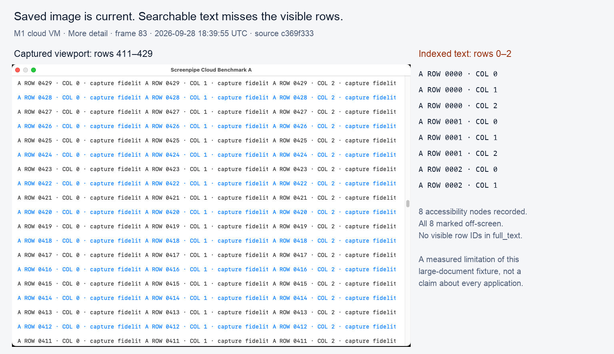

# PR 7335: cloud configuration benchmark, September 28, 2026

Status: partial. Apple Silicon is audited; Intel Mac and the two Windows configurations are still running. This is not an all-platform pass or merge approval.

Recorder source: `c369f333f2752bd6e0c243c2d665dafc49b9f21c`. The later `e5e459a8e24186e0042f93b089755e38c3e0c4b1` changes only frontend localization and its test mock; recorder code is identical. Running Mac harness: `39683a741`. Diagnostic `debug-dev` builds, audio off, high image quality, controlled automatic power policy. First-party Rust is unoptimized; these are not release or battery estimates.

## Apple Silicon result

Apple M1 VM, 3 logical CPUs, 7 GiB, macOS 14.8.9, 1920×1080. Three 60-second continuous-scroll repetitions per mode. CPU is a share of the VM's total logical CPU capacity; medians below. Max gap is the worst observed interval across the three repetitions, including the initial/final active boundary.

| Mode | Recorder CPU / machine capacity | Intermediate scroll captures / minute | Worst checkpoint gap | Process writes / active minute |
| --- | ---: | ---: | ---: | ---: |
| Low impact | 2.65% | 11 | 5.54 s | 6.73 MiB |
| Auto | 5.47% | 29 | 2.62 s | 11.62 MiB |
| More detail | 12.47% | 57 | 1.63 s | 26.25 MiB |

Auto stayed at 2 seconds throughout this fixture. Low impact stayed at 5 seconds and More detail at 1 second. First-launch power was battery saver on the 7 GiB machine; each run records that state before explicitly switching power to Automatic. No live adaptive transition was observed, so these trials do not independently validate its recovery/backoff thresholds.

Median per-trial p95 native event-dispatch latency: recorder off 4.32 ms, Low impact 5.52 ms, Auto 4.79 ms, More detail 7.85 ms. This is OS-event-to-handler latency in a synthetic AppKit fixture, not trackpad-to-photon latency. Native event coalescing also occurs with the recorder off. Main-run-loop heartbeat p95 was already 36.3 ms in the control, so it is not an FPS measurement. Short-scroll settled captures were present in all nine mode trials, at 0.35–0.83 seconds after the last received input. Final-frame timing is the persisted frame timestamp, not database commit or timeline visibility.

All 60 workload cases completed (15 each for control and the three modes). Native policy tests: `recording_detail::tests` 4 passed; `power::` 31 passed. All 401 images decode, match the expected fixture window by independent OCR, and have matching page identity in text/tree/elements. Nine old-window scroll rows remain unlinked at focus transitions, one in each mode/repetition; they are not counted as linked successes.

### Searchable-text failure in the large document fixture

Nonempty accessibility text is insufficient as a correctness gate. Independent OCR found no visible row IDs in `full_text` for 111/122 Auto frames, 49/57 Low impact frames and 208/222 More detail frames: 368/401 total. All visible row IDs were indexed in 11, 6 and 14 frames respectively; two Low impact frames were partial. This fixture has 800 rows × 3 AppKit labels. The traversal can exhaust its budget on off-screen children; the thin-text heuristic counts those characters as content. Higher detail permits larger extraction budgets but does not guarantee more useful visible text per frame. No matched base revision was run for this new fixture, so introduction of this issue is not attributed to the PR.

Frame 83 (More detail) shows rows 411–429; the persisted tree/full text contains only eight off-screen nodes from rows 0–2. The diagnostic below crops the actual saved image and lists its indexed row/column markers. [Exact frame metadata](m1-frame83.json).

### Evidence and limits

[Native run and artifacts](https://github.com/screenpipe/screenpipe/actions/runs/36461202548), [M1 evidence artifact](https://github.com/screenpipe/screenpipe/actions/runs/36461202548/artifacts/10990990978), [all per-case measurements and integrity summary](macos-14.json). Evidence artifacts expire after 14 days. Raw images, JSON exports, fixture traces and logs are also retained in the originating task workspace.

The More detail standalone SQLite artifact is incomplete: its WAL was omitted by the artifact allowlist, leaving 204 database frames versus 222 in the complete JSON export. All 222 exported images are present. The Auto and Low impact standalone databases match all exported table counts. This is an evidence-packaging limitation; it is not proof of recording data loss. Use exported rows and saved images for the full More detail trial.

Only one cloud VM per configuration, sequential repetitions, synthetic native input and one display. Window B starts at its scroll boundary; the focus case validates switching and input delivery, not actual scrolling in both windows. CPU excludes the fixture, WindowServer, children and host hypervisor. Audio/transcription, physical battery/thermals, physical input, release builds and the packaged timeline were not measured. Different OS fixtures and display sizes are not a controlled cross-OS CPU comparison.
