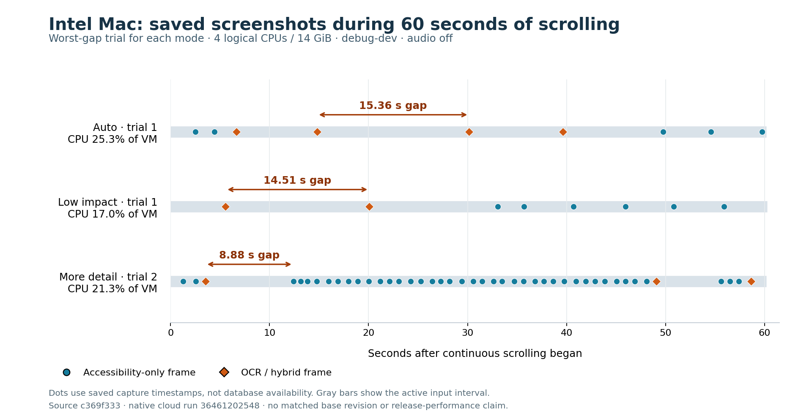

# PR 7335: cloud configuration benchmark, September 28, 2026

Status: partial. Apple Silicon and 4-core Windows are audited. Intel Mac has completed workloads, tests and the image/text audit. The original 2-core Windows run deviated from the protocol; one correction run uses the pinned 4-core harness and the same binary. This is not an all-platform pass or merge approval.

Recorder source: `c369f333f2752bd6e0c243c2d665dafc49b9f21c`. The later `e5e459a8e24186e0042f93b089755e38c3e0c4b1` changes only frontend localization and its test mock; recorder code is identical. Running Mac harness: `39683a741`. Diagnostic `debug-dev` builds, audio off, High image quality on Mac and Balanced on Windows, controlled automatic power policy. First-party Rust is unoptimized; these are not release or battery estimates.

## Apple Silicon result

Apple M1 VM, 3 logical CPUs, 7 GiB, macOS 14.8.9, 1920×1080. Three 60-second continuous-scroll repetitions per mode. CPU is a share of the VM's total logical CPU capacity; medians below. Max gap is the worst observed interval across the three repetitions, including the initial/final active boundary.

| Mode | Recorder CPU / machine capacity | Intermediate scroll captures / minute | Worst checkpoint gap | Process writes / active minute |
| --- | ---: | ---: | ---: | ---: |
| Low impact | 2.65% | 11 | 5.54 s | 6.73 MiB |
| Auto | 5.47% | 29 | 2.62 s | 11.62 MiB |
| More detail | 12.47% | 57 | 1.63 s | 26.25 MiB |

Sampled recorder RSS peaks during input were 220–262 MiB in Low impact, 320–329 MiB in Auto and 217–268 MiB in More detail. These are observed resident-memory samples, not process-tree memory or a leak test.

Auto stayed at 2 seconds throughout this fixture. Low impact stayed at 5 seconds and More detail at 1 second. First-launch power was battery saver on the 7 GiB machine; each run records that state before explicitly switching power to Automatic. No live adaptive transition was observed, so these trials do not independently validate its recovery/backoff thresholds.

Median per-trial p95 native event-dispatch latency: recorder off 4.32 ms, Low impact 5.52 ms, Auto 4.79 ms, More detail 7.85 ms. This is OS-event-to-handler latency in a synthetic AppKit fixture, not trackpad-to-photon latency. Native event coalescing also occurs with the recorder off. Main-run-loop heartbeat p95 was already 36.3 ms in the control, so it is not an FPS measurement. Short-scroll settled captures were present in all nine mode trials, at 0.35–0.83 seconds after the last received input. Final-frame timing is the persisted frame timestamp, not database commit or timeline visibility.

All 60 workload cases completed (15 each for control and the three modes). Native policy tests: `recording_detail::tests` 4 passed; `power::` 31 passed. All 401 images decode, match the expected fixture window by independent OCR, and have matching page identity in text/tree/elements. Nine old-window scroll rows remain unlinked at focus transitions, one in each mode/repetition; they are not counted as linked successes.

### Searchable-text failure in the large document fixture

Nonempty accessibility text is insufficient as a correctness gate. Independent OCR found no visible row IDs in `full_text` for 111/122 Auto frames, 49/57 Low impact frames and 208/222 More detail frames: 368/401 total. All visible row IDs were indexed in 11, 6 and 14 frames respectively; two Low impact frames were partial. This fixture has 800 rows × 3 AppKit labels. The traversal can exhaust its budget on off-screen children; the thin-text heuristic counts those characters as content. All 401 recorded accessibility walks were marked truncated by timeout; mean walk time was 103–105 ms per mode. Higher detail permits larger extraction budgets but does not guarantee more useful visible text per frame, and the existing per-app work limit can be tighter. No matched base revision was run for this new fixture, so introduction of this issue is not attributed to the PR.

Frame 83 (More detail) shows rows 411–429; the persisted tree/full text contains only eight off-screen nodes from rows 0–2. The diagnostic below crops the actual saved image and lists its indexed row/column markers. [Exact frame metadata](m1-frame83.json).

### Evidence and limits

[Native run and artifacts](https://github.com/screenpipe/screenpipe/actions/runs/36461202548), [M1 evidence artifact](https://github.com/screenpipe/screenpipe/actions/runs/36461202548/artifacts/10990990978), [all per-case measurements and integrity summary](macos-14.json). Evidence artifacts expire after 14 days. Raw images, JSON exports, fixture traces and logs are also retained in the originating task workspace.

The More detail standalone SQLite artifact is incomplete: its WAL was omitted by the artifact allowlist, leaving 204 database frames versus 222 in the complete JSON export. All 222 exported images are present. The Auto and Low impact standalone databases match all exported table counts. This is an evidence-packaging limitation; it is not proof of recording data loss. Use exported rows and saved images for the full More detail trial.

Only one cloud VM per configuration, sequential repetitions, synthetic native input and one display. Window B starts at its scroll boundary; the focus case validates switching and input delivery, not actual scrolling in both windows. CPU excludes the fixture, WindowServer, children and host hypervisor. Audio/transcription, physical battery/thermals, physical input, release builds and the packaged timeline were not measured. Different OS fixtures and display sizes are not a controlled cross-OS CPU comparison.

## Intel Mac result

Intel i7-8700B VM, 4 logical CPUs, 14 GiB, macOS 15.7.9, 1920×1080. All 60 native cases completed, with calibrated CPU counters and continuous movement within the document rather than at its boundary. Recording-detail tests passed 4/4 and power tests 31/31. The native test build took 23 minutes; the tests themselves passed before the 25-minute step limit. [Complete measurements](macos-15-intel.json) · [Native evidence artifact](https://github.com/screenpipe/screenpipe/actions/runs/36461202548/artifacts/10992935787).

The same native AppKit fixture and High image quality were used as on M1; mode order was control → More detail → Low impact → Auto. Values are medians with per-trial ranges, not confidence intervals. These are three repetitions on one VM, and the first trials show substantial variability.

| Mode | Recorder CPU / machine capacity, median (range) | Scroll checkpoints during input, median (range) | Worst checkpoint gap | Process writes / active minute |
| --- | ---: | ---: | ---: | ---: |
| Low impact | 5.41% (3.82–17.01) | 11 (8–11) | 14.51 s | 4.76 MiB |
| Auto | 4.66% (3.89–25.33) | 11 (9–11) | 15.36 s | 4.60 MiB |
| More detail | 21.34% (14.37–22.45) | 44 (40–57) | 8.88 s | 13.29 MiB |

Sampled recorder RSS peaks during input were 328–395 MiB in Low impact, 266–396 MiB in Auto and 338–383 MiB in More detail. One short run cannot establish long-term memory stability.

Auto changed from 2 seconds to 5 seconds with reason `capture_cost`; Low impact stayed at 5 seconds and More detail at 1 second. More detail's target did not prevent an 8.88-second gap. The longest gaps in every mode followed OCR/hybrid frames: Auto 15.36 seconds after frame 8, Low impact 14.51 seconds after frame 5, and More detail 8.88 seconds after frame 62. Reported mean OCR operation time was 7.07–8.86 seconds per mode. This is consistent with expensive OCR delaying the serial capture path; it is not an isolated experiment proving every contributor. The JSON retains the exact frame pairs. `avg_db_latency_ms` receives full paired-capture duration in this implementation, so it must not be interpreted as an isolated SQLite write benchmark.

All 301 images decode and match the expected page; all standalone SQLite frame, UI-event and element counts agree with exports. Yet 256 images have zero visible-row overlap with searchable text: Auto 42/55, Low impact 41/54, More detail 173/192. Seventeen have complete marker recall and 28 are partial. Of 301 AX walks, 292 timed out and nine were empty. The same large-tree visible-text limitation occurs on both Mac architectures. Six unlinked scroll rows occur at focus transitions. **Two incorrect links were found:** Low impact UI event 19 from window A links to frame 17 from window B, and More detail UI event 220 from A links to frame 189 from B. Independent image OCR confirms B pixels in both frames. The frame’s own page identity is consistent; event-to-frame context association fails. [Exact two failure records](intel-event-frame-link-failures.json). A More detail linker warning records one expired pending entry. End health remains “healthy” with zero reported frame drops, which does not certify timely or text-complete capture.

All nine short-scroll tails have linked captures, with timestamp delays 0.31–1.74 seconds. Continuous tails range 0.65–5.65 seconds. These are capture timestamps, not database availability. Median per-trial p95 event dispatch is 22.51 ms with recording off, 23.87 Low impact, 27.41 Auto and 24.21 More detail. Auto's worst per-trial p95 is 60.00 ms. This synthetic input-to-handler metric does not measure rendered scrolling smoothness. Cold More detail startup reported 19.04 seconds to the first frame; fresh environment setup and initial OCR are included.

## Windows 11, 4 logical CPUs / 16 GiB

Azure Standard_D4as_v5, AMD EPYC 9V74, Windows 11 build 26100, Edge 154.0.4258.37, 1024×768. Same `c369f333` source, `debug-dev`, audio off, Balanced image quality. Three 60-second native-wheel trials per mode. The final 4.3–6.0 seconds are at the document boundary; saved-image row markers confirm movement throughout the preceding 54–55 seconds. [Independent results, hardware, per-trial measurements and test commands](windows-4core.json).

| Mode | Recorder CPU / machine capacity | Scroll-triggered checkpoints during input, median | All frames during input, median | Worst interval between active frames |
| --- | ---: | ---: | ---: | ---: |
| Low impact | 7.01% | 11 | 13 | 5.25 s |
| Auto | 7.58% | 11 | 14 | 5.25 s |
| More detail | 11.63% | 58 | 58 | 1.28 s |

Active sampled recorder working-set maxima ranged 58–99 MiB in Auto, 59–108 MiB in Low impact and 57–109 MiB in More detail. These use `WorkingSet64`, exclude descendants and are distinct from lifetime peak working set. They are not directly comparable to a full process-tree footprint on Mac.

CPU is the median of three recorder-only CPU-time delta averages, using samples strictly inside the input interval (58.7–59.9 seconds observed). It excludes child Bun/conhost processes, fixture/Edge and the OS. The original guest's per-sample medians include a different process set and must not be mixed with these averages. Windows gaps above are between stored active frames; unlike the Mac checkpoint-gap metric they do not include the initial/final active boundary. Windows process I/O was not sampled; saved JPEG bytes are recorded separately and are not total disk writes.

Auto began at 2 seconds and ended at 5 seconds with reason `capture_cost`, while AC power stayed nominal/performance. This confirms live backoff in the fixture, not a precise switch-time or recovery measurement. Low impact stayed at 5 seconds and More detail at 1 second. All nine continuous final captures were present: frame timestamps were 0.22–0.87 seconds after input. The first database poll already contained the tail, so its 1.51–2.73-second observations are upper bounds from delayed polling, not precise database write latency. Frame-link completion timing was not measured.

All 406 database frames have corresponding readable images, with complete stopped-database evidence. Of 400 images containing visible row markers, zero had no marker represented in searchable text. Strict marker recall is complete in 354; another 45 become complete after normalizing the OCR confusion O→0. One remains partial. This measures fixture row-marker recall, not general text transcription accuracy. Stored text includes accessibility, OCR and hybrid sources, so zero tree nodes alone does not mean missing text.

Native test filters passed: recording detail 6, power 39, event-driven capture 98, accessibility scroll 16. Filters overlap, so these counts are not a unique-test total. The optional Tauri persistence test was skipped for budget. Automatic's navigation action failed to change pages and is retained as an invalid case; the other modes verified Page B and focus-away/back. Quiet samples include reset/focus-related captures. Foreground latency was not measured; CPU alone cannot establish that users will see no lag. The accompanying 15-second desktop video is illustrative native scrolling with the recorder off, not a recording of the full benchmark or saved-frame playback.

## Original 2-core Windows run: protocol deviation

The original Standard_D2as_v5 run is retained separately and is **not a matched performance pass**. Its blocking `Get-Counter` sampler stretched intended 30-second idle periods to roughly 62 seconds and 12-second quiet periods to roughly 24 seconds. It stored aggregate process-family counters, so recorder-only CPU cannot be reconstructed. All nine actual long-input spans were 59.951–59.967 seconds with 1,200 events each. [Original independent summary](windows-2core-original-protocol-deviation.json).

All 439 database frames have matching saved images. Independent OCR found visible row markers in 437 images; 20 had zero overlap with searchable `full_text`. Strict marker recall was complete in 391; another 25 become complete after the narrowly defined O→0 normalization. Twenty-one remain partial, including those zero-overlap frames. This is an observed failure under a contaminated measurement workload, not a controlled hardware comparison or proof of a newly introduced regression.

Automatic frame 33 visibly shows rows 56–57, while stored accessibility/full text stops at row 53. None of its row-marker nodes are marked on-screen. No retained per-tree timestamp or walk-duration field distinguishes a truncated traversal from stale accessibility content, so the cause remains undetermined. [Exact stored frame/text and OCR evidence](windows-original-2core-frame33.json) · [Saved image](windows-original-2core-frame33.jpg).

One fresh 2-core correction run uses the same verified executable, fixtures and final retained 4-core sampler. The original 4-core script was updated after Automatic and before Low impact; original Automatic script bytes were not retained, so an exact navigation-only diff is not established. This limitation is preserved even though the recorded input and sampler protocol agrees.

Independent page-identity checks found no confirmed cross-page mismatch in either original Windows run, with missing markers labeled unverified. However, Page B pixels appear only in 4-core Low impact (four frames) and More detail (three frames). Neither 4-core Auto nor any original 2-core mode has a saved Page B frame, so those navigation cases are not validated. Page identity does not establish row completeness or temporal alignment.

## Device tier and Automatic behavior

Existing [hardware classification](https://github.com/screenpipe/screenpipe/blob/c369f333f2752bd6e0c243c2d665dafc49b9f21c/crates/screenpipe-config/src/defaults.rs#L52) selects conservative defaults and resource sizing. Fresh Low-tier installs start with Low image quality and battery saver; existing preferences are preserved. The controlled trials explicitly choose their common image quality and Automatic power, so they do not represent untouched first-launch defaults.

The [detail controller](https://github.com/screenpipe/screenpipe/blob/c369f333f2752bd6e0c243c2d665dafc49b9f21c/crates/screenpipe-engine/src/recording_detail.rs#L98) measures successful focused-monitor capture duration. Three consecutive captures above 750 ms back off one interval; ten below 250 ms recover one interval, within 1/2/5 seconds. It does not directly enforce a whole-machine CPU target. Fixed detail modes do not use capture-cost backoff; all modes still honor temporary power floors. Cloud AC/nominal state cannot validate real battery or thermal behavior.

## Findings to address before a performance claim

1. **Visible text coverage:** both Mac architectures can save the correct screenshot while indexing only off-screen rows. Prioritize visible accessibility content and evaluate the OCR fallback using useful visible text, with a bounded extraction path.
2. **Serial capture stalls:** Intel OCR/hybrid operations coincide with 7–15-second capture gaps. Profile the capture path in a release build, and evaluate bounded asynchronous OCR while keeping every extraction tied to its original screenshot. Increasing the nominal checkpoint frequency alone does not remove this bottleneck.
3. **Event context correctness:** two Intel scroll events from A link to B screenshots after a focus transition. The linker needs a regression case for window/page identity across delayed capture and focus changes.
4. **Validation scope:** test release builds, multiple displays, real battery/thermal conditions, audio enabled and actual foreground input-to-display latency. These VM measurements identify problems and relative mode costs within a configuration; they cannot certify “no lag” on physical devices.

No matched base revision was run for this new fixture. These are observed issues, not established PR-introduced regressions. Native unit-test success and a healthy recorder endpoint do not override the saved-data failures. The draft PR remains unmerged.
